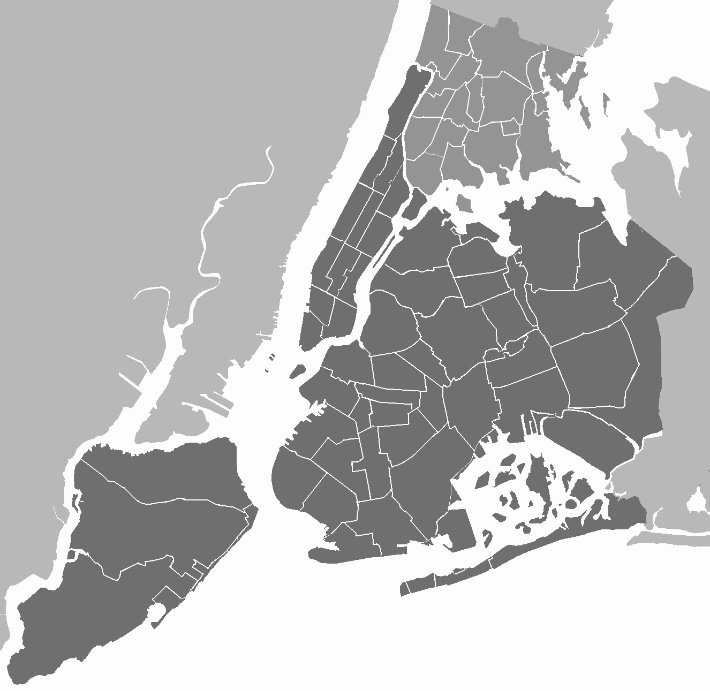

# NYC Airbnb 短租市场可视化分析

> 基于 2019 年纽约市 Airbnb 开放数据的探索性数据分析（EDA）与可视化项目，覆盖数据质量、价格结构、地理分布、房东供给与评论趋势，并给出可进一步研究的 Issues。



---

## 项目简介

本项目对纽约市 Airbnb 房源数据做了一次尽可能详尽的 EDA，目标是把"纽约短租市场长什么样"讲清楚：哪里最贵、谁在供给、价格由什么驱动、评论活跃度如何随时间变化。最终产出 12 张静态图表 + 1 张可交互地理地图，并在结尾梳理了核心业务洞察与后续研究方向。

- **数据规模**：约 4.9 万条房源记录（2019 年快照）
- **清洗后有效样本**：48,645 套房源
- **产出**：12 张 PNG 图表 + `airbnb_nyc_map.html` 全量房源交互地图

---

## 数据集

| 项目 | 说明 |
|---|---|
| 名称 | New York City Airbnb Open Data |
| 来源 | Kaggle（dgomonov / data-exploration-on-nyc-airbnb） |
| 链接 | https://www.kaggle.com/code/dgomonov/data-exploration-on-nyc-airbnb |
| 文件 | `AB_NYC_2019.csv`（需自行从 Kaggle 下载，放置于项目根目录） |
| 规模 | ~49,000 行 × 16 列 |

### 数据字典

| 字段 | 含义 |
|---|---|
| `id` | 房源唯一 ID |
| `name` | 房源标题 |
| `host_id` / `host_name` | 房东 ID / 名称 |
| `neighbourhood_group` | 行政区（NYC 5 区：Manhattan / Brooklyn / Queens / Bronx / Staten Island） |
| `neighbourhood` | 更具体的社区 |
| `latitude` / `longitude` | 经纬度 |
| `room_type` | 房型：整套房源 / 独立房间 / 合住房间 / 酒店房间 |
| `price` | 每晚价格（美元） |
| `minimum_nights` | 最小入住夜数 |
| `number_of_reviews` | 评论总数 |
| `last_review` | 最近一次评论日期 |
| `reviews_per_month` | 月均评论数 |
| `calculated_host_listings_count` | 该房东在 NYC 的总房源数 |
| `availability_365` | 未来 365 天可订天数 |

---

## 技术栈

`Python` · `Pandas` · `Numpy` · `Matplotlib` · `Seaborn` · `Folium` · `Jupyter Notebook`

---

## 项目结构

```text
1 - 纽约市Airbnb/
├── 代码.ipynb              # 主分析 Notebook（12 节完整 EDA）
├── AB_NYC_2019.csv         # 数据集（需从 Kaggle 下载，与 Notebook 同目录）
├── airbnb_analysis.py      # 参考样板脚本
├── New_York_City_.png      # README 封面图
├── 报告.html               # 导出的完整分析报告（含代码）
├── 报告_读者版.html        # 导出的读者版报告（隐藏代码）
├── output/                 # 运行 Notebook 后自动生成
│   ├── 01_price_outlier.png        # 价格离群检测
│   ├── 02_price_log.png            # 价格对数分布
│   ├── 03_univariate.png           # 单变量分布（行政区/房型/最小夜数/可订天数）
│   ├── 04_borough.png              # 行政区：房源数 vs 均价
│   ├── 05_roomtype.png             # 各房型价格分布
│   ├── 06_pivot_heatmap.png        # 行政区×房型 均价热力图
│   ├── 07_price_rel.png            # 价格 vs 可订天数 / 评论数
│   ├── 08_corr.png                 # 数值特征相关性矩阵
│   ├── 09_geo_scatter.png          # 房源地理分布（按行政区着色）
│   ├── 10_density.png              # 各行政区房源密度
│   ├── 11_host.png                 # 多房源 vs 单一房源 价格分布
│   ├── 12_review_trend.png         # 评论时间趋势（按年/季度）
│   └── airbnb_nyc_map.html         # 全量房源交互地图（约 4.9 万点，可点开看明细）
└── README.md
```

> **GitHub 友好**：Notebook 通过 `_project_dir()` 自动定位自身所在目录，数据集与输出目录均使用相对路径，无需任何绝对路径配置，克隆到任意机器均可直接运行。

---

## 环境安装与运行

```bash
# 1. 安装依赖
pip install pandas numpy matplotlib seaborn folium jupyter

# 2. 下载数据集 AB_NYC_2019.csv，放到与 代码.ipynb 同一目录

# 3. 启动 Notebook
jupyter notebook 代码.ipynb
```

运行说明：

- 数据集 `AB_NYC_2019.csv` 必须与 `代码.ipynb` 处于**同一目录**；缺失会直接报错提示。
- 图表自动保存到 `output/` 目录（目录会自动创建）。
- 中文字体自动适配 Windows 系统字体（SimHei / 微软雅黑 / 宋体），未找到时会给出提示，不影响数值分析。
- 交互地图 `output/airbnb_nyc_map.html` 用浏览器打开即可缩放、点击房源查看 8 项明细。

---

## Notebook 结构（12 节）

1. 环境配置与路径
2. 数据载入与字段说明
3. 数据质量探查（缺失 / 重复 / 离群 / 坐标）
4. 数据清洗与决策（含清洗前后对比）
5. 单变量分布分析
6. 分组 / 双变量分析
7. 地理空间可视化（Folium 交互地图 + 静态散点）
8. 房东与供给分析
9. 评论时间趋势
10. 业务洞察
11. 可进一步研究的问题（Issues）
12. 总结

---

## 核心发现

基于 2019 年快照、清洗后 48,645 套有效房源：

- **地理高度集中**：Manhattan + Brooklyn 合计约占 **85%** 的房源。
- **价格梯度明显**：Manhattan 均价约 **$185**，外圈更便宜（Staten Island 约 **$103**），但越往外圈年可订天数越长。
- **房型结构**：整套/公寓约 **52%**，独立房间约 **46%**，合住房间不足 3%。
- **供给集中**：约 **34%** 房源来自 ≥2 套的多房源房东（职业 / 商业运营信号）。
- **评论高峰**：最近一次评论的高峰出现在 **2019 年**，约 25,209 套。

> 详细结论与"给房东 / 平台 / 游客的三方建议"见 Notebook 第 12 节。

---

## 可视化成果

运行 Notebook 后，以下图表会生成在 `output/` 目录：

| 图表 | 文件 | 对应章节 |
|---|---|---|
| 价格离群检测 | `01_price_outlier.png` | 3.2 |
| 价格对数分布 | `02_price_log.png` | 5 |
| 单变量分布 | `03_univariate.png` | 5 |
| 行政区房源数 vs 均价 | `04_borough.png` | 6 |
| 各房型价格分布 | `05_roomtype.png` | 6 |
| 行政区×房型均价热力图 | `06_pivot_heatmap.png` | 6 |
| 价格关联散点 | `07_price_rel.png` | 6 |
| 相关性矩阵 | `08_corr.png` | 6 |
| 地理分布散点 | `09_geo_scatter.png` | 7 |
| 行政区房源密度 | `10_density.png` | 7 |
| 房东供给价格分布 | `11_host.png` | 8 |
| 评论时间趋势 | `12_review_trend.png` | 9 |
| 全量房源交互地图 | `airbnb_nyc_map.html` | 7 |

---

## 局限与进一步研究方向（Issues）

1. **价格驱动因子建模**：用回归 / 随机森林量化 `room_type`、`neighbourhood`、`availability_365` 对 `price` 的贡献。
2. **商业运营识别**：高 `calculated_host_listings_count` 房东是否规避酒店业监管？结合 NYC 2018《短期租赁限制法》做合规分析。
3. **评论情感分析**：补充评论文本做 NLP 情感分析，联动价格与区位。
4. **时间维度补全**：数据集只有 `last_review`，无逐月评论量；补全后可分析季节性（节假日、展会）对入住率的影响。
5. **可用性悖论**：大量房源 `availability_365` 接近 0 却有评论，需核对数据口径。
6. **空间自相关**：用 Moran's I 检验房价地理聚集，比热力图更具统计严谨性。
7. **供需与收入估算**：结合房源数、均价、可订天数估算各行政区 Airbnb 总营收，对比传统酒店业。
8. **公平性**：高价值房源是否加剧社区绅士化？可关联社区人口 / 收入外部数据。

---

## 作者

任逸飞
